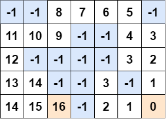
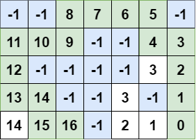

<!-- image -->
<div align="center" id="top"> 
  
  &#xa0;
</div>

<h1 align="center"> wavefront-path-planning </h1>
<h2 align="center"> Path planning algorithm based on a grid map using wavefront approach for mobile robots
 </h2>

<!-- https://shields.io/ -->
<p align="center">
  
  
  
</p>

<!-- table of contents -->
<p align="center">
  <a href="#dart-about">About</a> &#xa0; | &#xa0;
  <a href="#package-content">Content</a> &#xa0; | &#xa0;
  <a href="#microscope-tests">Tests</a> &#xa0; | &#xa0;
  <a href="#checkered_flag-starting">Starting</a> &#xa0; | &#xa0;
  <a href="#eyes-implementation">Implementation</a> &#xa0; | &#xa0;
  <a href="#memo-license">License</a> &#xa0; | &#xa0;
  <a href="#technologist-author">Author</a> &#xa0; | &#xa0;
</p>

<br>


## :dart: About ##
Script execute wavefront algorithm for finding path between robot position and target, based on occupany grid map. The assumptions are to find a path that avoids collision with obstacles and the path should be found in every possible case in a finite time.

---
You can find more about occupany grid mapping algorithm here: [KamilGos/occupancy-grid-mapping](https://github.com/KamilGos/occupancy-grid-mapping)

## :package: Content
 * [path_planning.py](path_planning.py) - implementation of path-planning algirithm 
 * [data/ex1](data/ex1.json), [data/ex2](data/ex2.json) - files with example data


## :checkered_flag: Starting ##
```bash
# Clone this project
$ git clone https://github.com/KamilGos/wavefront-path-planning

# Access
$ cd wavefront-path-planning

# Run the project
$ sudo python3 path_planning.py
```

## :eyes: Implementation ##
<h2>Wavefron planner:</h2>
Wavefront planner is a common algorithm used to determine the shortest paths between two points. It works with a raster map. The input of this algorithm is the binary occupancy grid map, where the obstacles are represented as ones and the empty area as zeros. To handle the assumption of collision avoidance, the binary map fields are adjusted to the width of the robot, so the planned path would be wide enough for the robot to follow. Base on this map, a new map is created. The obstacle cells get the -1 value, and the goal field gets 0. Every other cell has a value set to infinity. The example of such matrix is shown in the figure a. The next step is to fill the matrix with incrementally increasing values. The algorithm starts its work in the goal cell. Every adjacent cell gets a value one bigger than its lover-valued neighbor. This procedure is repeated until the adjacent cell is the starting cell is reached or there still exists cell with infinity value. Figure b shows the example of such a map. The last step is to select the final path from the starting cell to the goal, which is related to a series of cells with decreasing values. Figure c shows the found path (the length of a path is 17). 

| a    | b    | c    |
|---------------- | --------------- | --------------- |
|     |     |     |


<h2>Control values</h2>
The algorithm required several parameters to work: box size, room size, probability of hit, probability of miss and width of the robot. 

* The map is represented as two-dimensional square array with the size (xSize*ySize). **roomSize** represents size of the area in which the robot operates and the **boxSize** represents the density of squares in total area. The bigger the value, the lowerresolution of the room is generated and the algorithm require more time to execute.
<div align="center" id="put_id"> 
  
  &#xa0;
</div>

* Each value of the box on the map represents the probability of an obstacle. The value equal to 0.5 is related to lack of knowledge about the field. Every value higher than 0.5 means, that there is higher probability of obstacle in this filed, and if the value is lower than 0.5, the field is assumed empty. The algorithm update each filed when new sensor reading appears. If the obstacle is detected, then the value is increasing logarithmically:<center>value = value + log(**probHit** / 1-**probHit**)</center>Every field on the path between the robot and an obstacle is treated as empty so the probability is decreasing.<center>value = value + log(**probMiss** / 1-**probMiss**)</center>To prevent a situation that values are out of reasonable range a limit was included, setting the minimum value to 0 and maximum to 1. 

* **Width of the robot** determines how exact the binary map will be generated and how exact is the representation of environment. The greater the value, the more information about the map will be lost, but the path will be safer (longer distance to closest obstacle).

## :microscope: Tests ##

<h2 align="left">Robot width </h1>
Figures shows the comparison of algorithm results for two values of robot width: 0.2 and 0.5. Others variables were set as: box size=0.1, room size=15, probability of hit=0.9 and probability of miss=0.4. 
<div align="center" id="put_id"> 
  
  
  &#xa0;
</div>


## :memo: License ##

This project is under license from MIT.

## :technologist: Author ##

Made with :heart: by <a href="https://github.com/KamilGos" target="_blank">Kamil Goś</a>

&#xa0;

<a href="#top">Back to top</a>